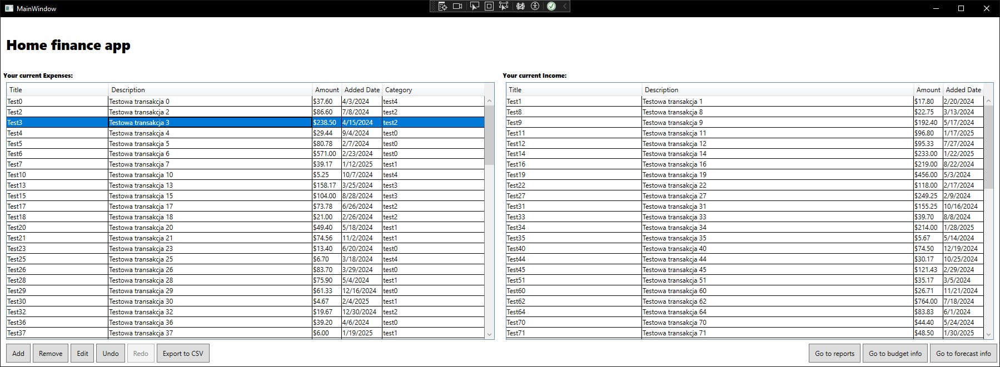
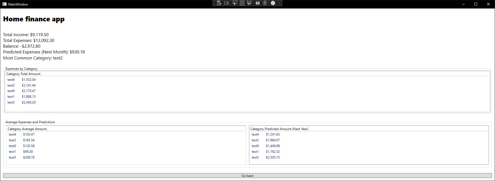
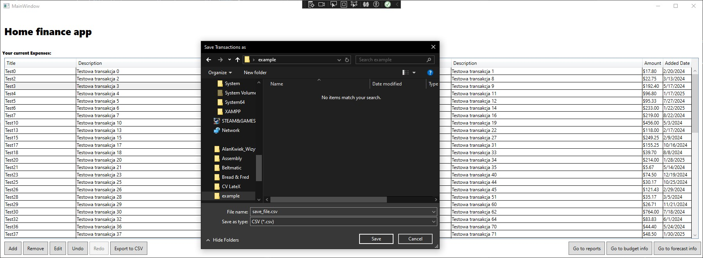
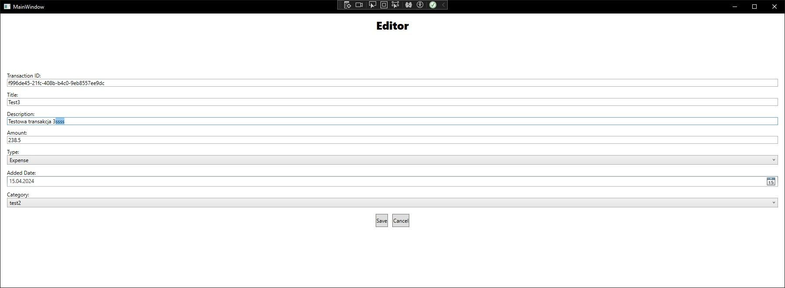
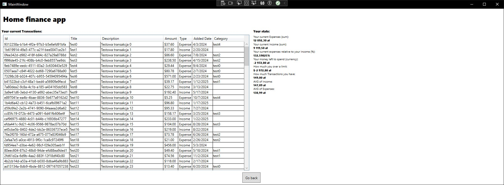

# 💰 Expense and Budget Management

A modern WPF desktop application to **manage personal finances**, track **income and expenses**, **plan budgets**, and generate insightful **financial reports**. Built with design patterns, robust validation, and user-friendly UI.

> 📊 Stay in control of your money. Plan. Predict. Prosper.

---

## ✨ Features

### 📒 Transaction Management

* ➕ Add, ✏️ edit, and ❌ delete transactions
* 📋 View transactions in structured lists

### 📈 Reporting & Forecasting

* 🗓️ Monthly / yearly report generation
* 📄 Export reports to PDF
* 🔮 Forecast future expenses based on history

### 💼 Budget Planning

* 💡 Create and manage budgets
* 🚨 Get notified when budgets are exceeded
* 📉 Analyze expected future financials

### 🔔 Alerts

* Receive real-time **notifications** about:

  * Exceeded budgets
  * Achieved savings
* Configure and customize alert triggers

### ✅ Data Validation

* Currency, numeric separators, and text formatting
* Automatic capitalization and input checks

### ↩️ Undo / Redo (Command Pattern)

* Undo or redo any action with full command history

### 🧠 Design Patterns Used

* 🧱 **Builder** – PDF creation
* 🎮 **Command** – Undo/redo actions
* 👀 **Observer** – Budget status notifications
* 🔒 **Proxy** – Data validation control
* 🔀 **Strategy** – Dynamic report generation

---

## 🖼️ UI Preview

Below are example screenshots of the application views. Update the links after adding the images to your repo:

### 📊 Main View

The main dashboard with quick access to transactions, budgets, and reports.

---

### 📑 Report View

Monthly and yearly reports with PDF export functionality.

---

### 📉 Forecast View

Financial forecasting based on historical data analysis.

---

### 📂 Export to CSV

Export transaction data to CSV format with date range selection.

---

### 📝 Editor View

Adding and editing individual transactions through an intuitive form.

---

### 💼 Budget View

Creating, editing, and monitoring budgets with overflow alerts.

---

If you want, I can also prepare this section formatted as a table or side-by-side thumbnails in Markdown or HTML. Would you like that?

---

## 🛠️ Technologies Used

* `C# .NET 8.0`
* `WPF (MVVM)`
* `QuestPDF` (PDF generation)
* Manual implementation of design patterns (no external MVVM frameworks)
